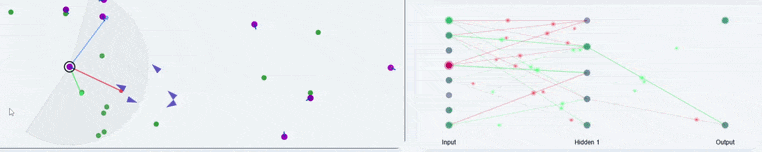

# 🧬 Evolving Ecosystem Simulation

An agent-based ecosystem where predators and herbivores develop emergent survival behaviours entirely through neuroevolution — no hand-crafted rules, no reinforcement learning rewards. Just mutation, selection pressure, and time.


---

## The Core Idea

Every animal in this simulation has a neural network for a brain. At the start, these networks are essentially random — the animals stumble around, achieve nothing, and die. But across generations, random mutations to network weights and topology compound into something genuinely surprising: coordinated group behaviour, predator evasion strategies, and population dynamics that mirror real ecological theory.

The evolution engine is a custom implementation of **NEAT (NeuroEvolution of Augmenting Topologies)** — an algorithm that evolves not just the weights of a fixed network, but the structure of the network itself. Hidden neurons appear, connections are rewired, and each generation's survivors pass their neural architecture — plus mutations — to the next.

There are no training labels. No reward functions tuned by hand. The only feedback is survival and reproduction.

---

## Emergent Behaviours

Here are some example of behaviours that I have seen emerge in my sessions:

### Herbivore Flocking
Herbivores discovered travelling as groups — a direct analogue of real-world anti-predator herding.


### Predator Evasion
Herbivore brains learned swerve and flee nearby predators. They are not perfect though - some still get eaten!


### Predators Huntings
Predators evolved being almost motionless when they dont detect any prey to conserve energy, then pouncing on the prey that enters its vision range!


### Predators Camping in the bushes
Predator groups that stake out dense plant patches and wait for herbivores to arrive, rather than expending energy on active pursuit.


### Lotka-Volterra Population Dynamics
The simulation spontaneously reproduces the classic predator-prey population cycle — predator numbers lag behind prey, both oscillating in a self-sustaining rhythm. 


### Neural Network Visualisation
Each animal's brain can be inspected in real time, showing live activation as it navigates the world.



### Brain Designer
Networks can be seeded or modified manually through a visual brain designer interface. You can have a go at creating your own neural network brain, and see how it survives!


---

## How the Evolution Works

Each animal's genome encodes a neural network. On reproduction (currently asexual — each animal buds off a mutated copy), the offspring receives its parent's network with random perturbations applied:

- **Weight mutation** — existing connection strengths shift by small random amounts
- **Structural augmentation** — new neurons and connections can be inserted, expanding the network's representational capacity over generations

This is the NEAT approach: topology and weights co-evolve, so the network complexity of a successful lineage grows organically rather than being fixed at initialisation.

The current architecture connects every neuron in each layer to every neuron in the next (fully connected, layer-by-layer). Skip connections — direct links from earlier layers to later ones, bypassing intermediate layers — are a planned extension.

---

## Tech Stack

**Backend — Python simulation server**
- `NumPy` + vectorisation — performant batch simulation of all agents each tick
- `PyTorch` — neural network forward passes and weight storage
- `FastAPI` + `Uvicorn` — REST API serving simulation state to the frontend
- `Pickle` / `pathlib` — save/load of simulation states and evolved genomes

**Frontend — Browser visualisation**
- `JavaScript` + `HTML/Canvas` — real-time rendering of the simulation world
- Web controls for parameters, speed, and inspection of individual agents

**Tooling**
- Agentic AI helped me a lot for frontend visualisation. The prevoius versions of this were in pygame, so I am happy to see the much prettier js visualisation.

---

## What I Learned Building This

Going in, I knew Python reasonably well. Coming out, I'd built working knowledge of:

- **Neural network fundamentals** — forward passes, activation functions, weight representations
- **The NEAT algorithm** — why evolving topology matters, and the non-trivial implementation challenges
- **PyTorch** — tensor operations, network construction, and how to use it beyond training pipelines
- **NumPy vectorisation** — rewriting naive loops as batch operations to keep the simulation running at interactive speeds with many simultaneous agents
- **FastAPI** — async server design, routing, and serving a stateful simulation over HTTP
- **JavaScript** — enough to build a functional, interactive frontend from scratch

The hardest part wasn't any single component — it was making all of them talk to each other at speed without the simulation grinding to a halt as agent counts grew.

---

## Possible Extensions

A few directions that didn't make the cut but remain genuinely interesting:

**Hosting** — Deploying this so anyone could run it in a browser is straightforward in principle: unique session IDs per user, a high-performance server to handle parallel simulations. The harder alternative would be porting the Python simulation server to JavaScript — attractive for a serverless setup, but NumPy and PyTorch have no direct JS equivalents, making matrix operations non-trivial to replicate at the same performance level.

**True NEAT with skip connections** — The current implementation is fully-connected layer-to-layer. Real NEAT allows arbitrary skip connections between any two neurons, which enables richer representational shortcuts and is closer to biological neural wiring. The implementation complexity is significant, but the behavioural payoff could be substantial.

**Sexual reproduction** — Current reproduction is asexual (parent → mutated copy). Crossover between two parent genomes — a core NEAT feature — would introduce more combinatorial variation and potentially accelerate adaptation.

**Metabolic cost of cognition** — Adding an energy penalty proportional to total neural activation would create evolutionary pressure toward efficient, sparse networks. Animals with unnecessarily large or active brains would die faster, naturally pruning redundant connections and driving the emergence of leaner cognitive strategies.

**Systematic parameter sweeps** — Running many parallel simulations across parameter ranges (mutation rates, population sizes, energy landscapes) to map which conditions produce the richest emergent behaviour.

---

## Running the Simulation INCOMPLETE

```bash
# Install dependencies
pip install numpy torch fastapi uvicorn

```
